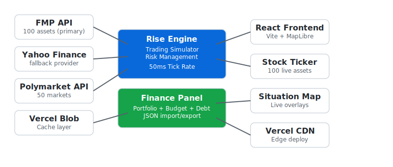

# Opticon


Opticon is a live map and market app. Prices, news, and local activity on one screen. Think Google Maps meets a financial terminal.

[Live site](https://opticon.heyitsmejosh.com)

## Architecture



## Features

### Map (core)
- Live interactive map (MapLibre GL, CartoDB basemaps)
- Browser geolocation with IP fallback
- Dark/light theme-aware tiles
- World city hub markers

### Data Layers (live)
- Nearby flights (OpenSky Network)
- Traffic congestion and road incidents
- Earthquakes (USGS, M4+ highlighted)
- Weather alerts
- GDELT news geo-mapping
- Prediction markets overlay (Polymarket)

### Planned: Google Maps Parity
- Directions and routing
- Street View
- Transit and public transport
- Satellite and terrain views
- Place search (POI)
- Business listings
- Reviews and ratings
- Indoor maps
- Bike and walk routes
- Real-time ETAs
- Offline maps

### Planned: Beyond Maps
- Crime heat maps
- Air quality index
- Wildfire tracking
- Flood zones
- Power outage mapping
- Protest and demonstration tracking
- Military movement data
- Pandemic overlays
- Economic indicators by region
- Port and shipping activity

### Trading Simulator
- Start at $1, scale to $1T
- 167 tradeable assets (US50 stocks, indices, crypto, meme coins)
- Live price feeds (Yahoo Finance, FMP)
- Kelly Criterion position sizing
- Prediction market trading (Polymarket)
- Win rate, PnL, and runtime tracking
- Fibonacci price levels

### Portfolio
- Stock holdings with gain/loss tracking
- Cash accounts (multi-currency)
- Budget (income vs expenses, surplus)
- Debt tracking with payoff timeline
- Savings goals with progress bars
- Spending analysis with statement upload
- Editable data with server sync

### Other
- Live stock ticker bar
- Auth (bcrypt, KV sessions)
- Stripe billing (Free / $20 / $50 tiers)
- Apple Pay
- PWA with service worker
- iOS companion app (opticon-ios)
- macOS companion app (opticon-macos)

## Run It

```bash
npm install
npm run dev
npm test -- --run
npm run build
```

## Deploy

Production runs on Vercel. Cloudflare preview path documented in [docs/hosting.md](docs/hosting.md).

## License

MIT 2026, Joshua Trommel
