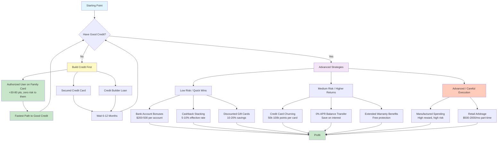
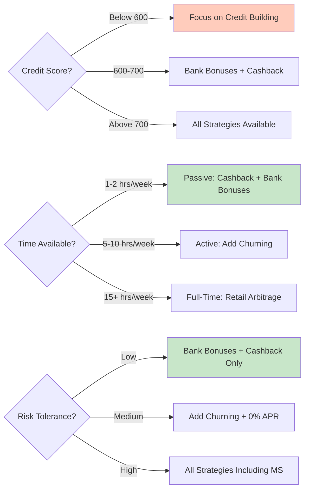

<!-- HIDDEN: Arby content folded into rise. Uncomment when ready to surface as a strategies tab.

# Strategies Reference

Consolidated from `~/Documents/Code/arby/README.md`, `~/Documents/Code/arby/index.html`, and `~/Documents/Code/arby/CLAUDE.md`.

## Project Overview

Financial arbitrage strategies and money-making ideas. This is a documentation/research reference, not a running application.

## Scope

- Credit card churning strategies
- Bank account bonus playbook
- Cashback stacking methods
- Retail arbitrage approach
- Credit building roadmap (authorized user method)

## Strategy Flow

## Decision Tree: Which Strategy Is Right For You?

## Credit Card Arbitrage

### Basic Concept

Use someone with good credit, get cashback, pay immediately, and split value created by rewards (typically 1-5%).

### Reality Check

Routing all purchases through someone else's card for cashback splitting is usually not worth the coordination overhead. Example from source: at `$500/month`, returns are around `$5-25` before any split.

### When It Works

Use selectively for high-category spend you were already going to make (for example, 5% grocery category spend).

### The Real Play: Authorized User

This is framed as the highest-leverage move versus cashback splitting:

- Primary cardholder's full payment history can be added to your credit report
- Potential score boost of roughly `+30-80` points (with established on-time history)
- You do not need to hold or use the physical card
- Primary cardholder retains control and can remove you anytime
- Claimed as zero score risk to the primary cardholder in the source docs

Suggested pitch from source material:

> You don't give me a card. You don't give me access. Nothing changes for you. You just call the bank and add my name. That's it. It helps me build credit and costs you nothing.

## Verified Money-Making Strategies

### 1. Bank Account Bonuses (Low Risk)

- Open checking accounts with signup bonuses (`$200-500`)
- Meet requirements (direct deposit, minimum balance, etc.)
- Close after ~6 months
- Repeat where viable
- Risk: frequency can impact ChexSystems profile

### 2. Cashback Stacking (Low Risk)

- Stack platform cashback with card rewards
- Example: Rakuten `5%` + card `1.5%` = `6.5%`
- Common platforms: Rakuten, Honey, TopCashback

### 3. Credit Card Churning (Medium Risk)

- Open cards for signup bonuses (`50k-100k` points)
- Meet minimum spend
- Redeem points for travel/cashback
- Cancel/downgrade before annual fee cycle as appropriate
- Warning: temporary credit-score impact and high discipline required

### 4. Discounted Gift Cards (Low Risk)

- Buy gift cards at `10-20%` off face value
- Use for planned recurring purchases
- Platforms: Raise, CardCash, Gift Card Granny
- Risk is lower when buying from verified sellers

### 5. Extended Warranty (Low Risk)

- Many cards extend manufacturer warranty automatically
- Useful for electronics/appliances
- Potential savings: roughly `$50-200+` on warranty-related costs

### 6. Manufactured Spending (High Risk)

- Example loop: buy money orders with card, deposit funds, pay card off
- Goal: generate points/cashback without net consumption
- Warning: issuer and bank crackdowns; elevated risk of account shutdown

### 7. Retail Arbitrage (Medium Risk)

- Buy clearance/underpriced inventory and resell on Amazon/eBay/marketplaces
- Requires sourcing, storage, shipping, and time
- Source estimate: `$500-2000/month` part-time potential

### 8. 0% APR Balance Transfer (Low Risk)

- Transfer high-interest balances to `0% APR` card (`12-21` months)
- Execute payoff during promo window
- Main watch-out: transfer fee (`3-5%`)

## Credit Building (Start Here First)

If credit is thin or poor, sequence here before advanced card strategies.

### 1. Secured Credit Card

- Deposit: typically `$200-500`
- Credit limit mirrors deposit
- Use lightly and pay in full
- Potential graduation to unsecured after `6-12` months

### 2. Authorized User on Good Account

- Join a parent/spouse/partner card with strong history
- Full account history may report to your profile
- Intended outcome: immediate credit-age and score lift (`+30-80` points in source)
- Physical card access not required
- Primary user can remove you at any time

### 3. Credit Builder Loan

- Make installment payments into secured savings
- Funds returned at term end (often ~12 months)
- Builds payment history

### 4. Rent/Utility Reporting

- Use services such as Experian Boost for alternative tradeline reporting
- Often free or low-cost

## Legacy Strategy Note

### Credit Card Price Protection (Legacy)

- Some cards historically reimbursed price drops within `60-120` days
- Source notes many issuers ended this benefit around `2018-2020`

## Tools & Resources

- Credit monitoring: Credit Karma, Experian (free tiers)
- Cashback: Rakuten, Honey, TopCashback
- Gift cards: Raise, CardCash, Gift Card Granny
- Bank bonus tracking: Doctor of Credit
- Community research: `r/churning`
- Reselling platforms/tools: Amazon Seller app, eBay, Facebook Marketplace

## Warnings

- Do not increase spending only to chase rewards
- Do not carry revolving card balances (interest can erase gains)
- Do not submit too many new card applications at once
- Do not close cards immediately after receiving bonuses
- Do not attempt manufactured spending without clear risk controls

## Status

- Verified by source project as of `2026-02-10`
- Source project state: idea/research stage
- No build/runtime step required in original `arby` project

## Disclaimer

This is not financial advice. Perform your own due diligence and validate current terms before executing any strategy.

-->
